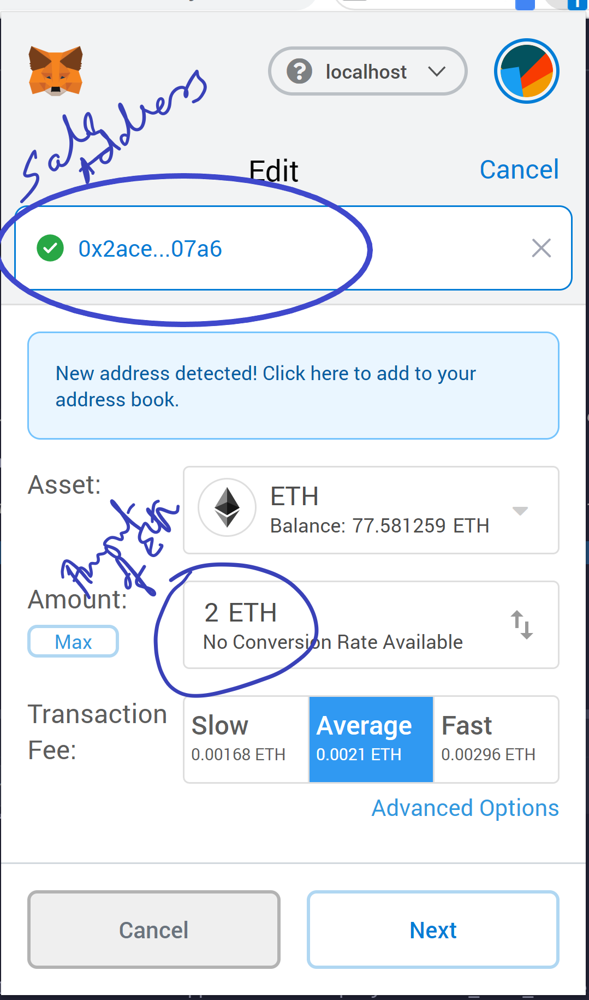
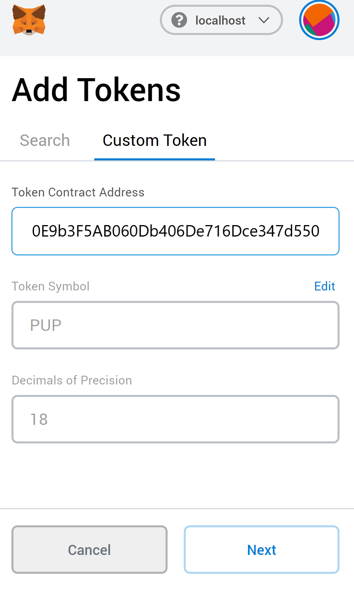
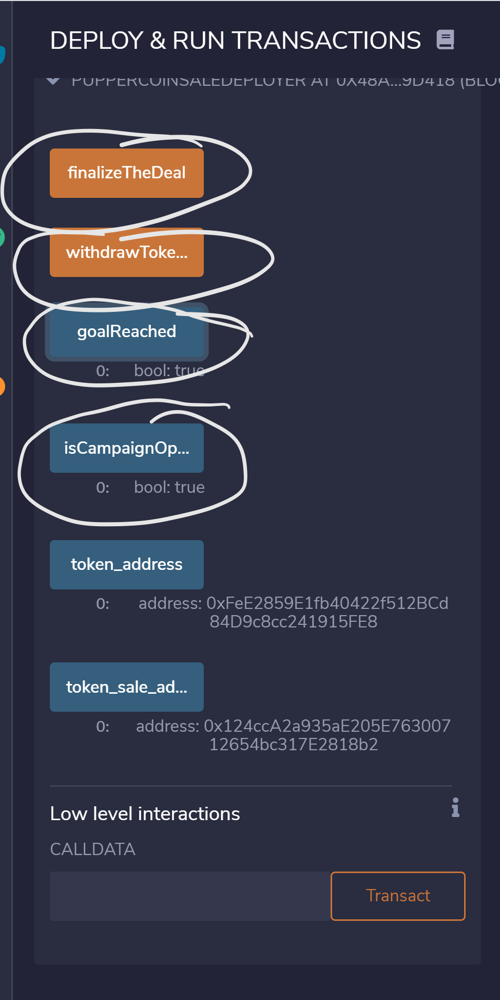

# CrowdFund (Crowdsale) Project and get Puppercoin Token (PUP) as reward
---
## Objective

- ### Purpose of this Solidity Contract is to CrowFund (crowdsale) a project and in return the beneficiary gets our custom PUP Token.

## Goal
- ### Our Goal is to collect 2 ETH and Cap is 50 ETH

## Process

### Connect to Kovan network
- Open Metamask (or MyCrypto Wallet)
 
### Send Funds to Sales Manager Address: 0x1aFB0466072890Cee6F70213ed4084d147bA4324
- Click on Send Button
- Give the above Sales Manager Address
- And desired amount of ETH ( Exchange for ETH to PUP is 1 to 1)
 

#### Crowdsale Completes in 24 weeks from Aug 20th, 2020 and a goal is set to 2 Eth is required. 
#### The CrowdFunding only allows for refunds or Distribution of Tokens once both the crowdsale is closed and the goal is met.

### How to collect PUP Token after crowdsale is completed:
- Click on Add Token
- Click on Custom Token
- Give the Token Address: 0x447bEc260E9b3F5AB060Db406De716Dce347d550
- And fill the details like so:

 

##### The Funds go to the wallet address: 0x59e89683BD9FcAEea66843De01F3a13e842CBD20
##### Contract Id which deployed the contract in Kovan Network: 0x9b5a253b0Ec5B437b72CFBC623084d9b3a32515D
https://kovan.etherscan.io/address/0x9b5a253b0ec5b437b72cfbc623084d9b3a32515d

---
## How to Run the Code and play around with it in your local testnet:

0. In `PupperCrowdsale.sol` you can change the close to be `now + 5 minutes` instead of `now + 24 weeks` if you want to see the full cycle of crowdfund close and token distribution
1. Compile PupperCrowdsale.sol
2. Deploy PupperCrowdsale.sol with Token name, Token Symbol and Wallet (address where the funds will go) (note the wallet address)
3. You get multiple functions:
- Click on goalReached to findout if the crowdsale goal has been reached or not.
- Click isCampaign open to check if crowdsale campaign is still open or not
- click on token_ddress Note the token address
- click on token_sale_address, Note the TokenSale address
* (Refer to Image below)
4. In meta mask change to another address.
5. Click send to the toke_sales_address you got from deployment
6. And desired amount of ETH ( Refer to the above `Send Fund to Sales Manager Address`)
7. Either Deploy SalesContract using the the token_sale_address from above) in Remix IDE in the Text box next to `At Address` button. Click on `At Address` button to deploy
`OR` continue with the salesdeployer which have wrapper functions to call the puppersales.sol and its inherited functions.
7. Once close period is up (in this case now + 5 minutes) click on `FinalizeTheDeal`  (It will cost gas, metamask will open, click on `confirm`)
    - if you click before the goal is reached or before crowdsale is closed you will get an error with exact error statement.
8. Once its finalized succesfully you will see the ETHs in the Wallet address you gave during deployment
    - if you click before the goal is reached or before crowdsale is closed you will get an error with exact error statement.
9. click on `withdrawToken` (It will cost gas, metamask will open, click on `confirm`)
10. Similarly if you want to reclaim your ETH after the crowdfund closes you can call `claimRefund`
10. In metamask connect to the address which sent ETH in get PUP Token
11. Follow the above section of `how to collect PUP token after crowdsale` with your own token address the you noted after deployment
12. You should see the PUP Token in your address

